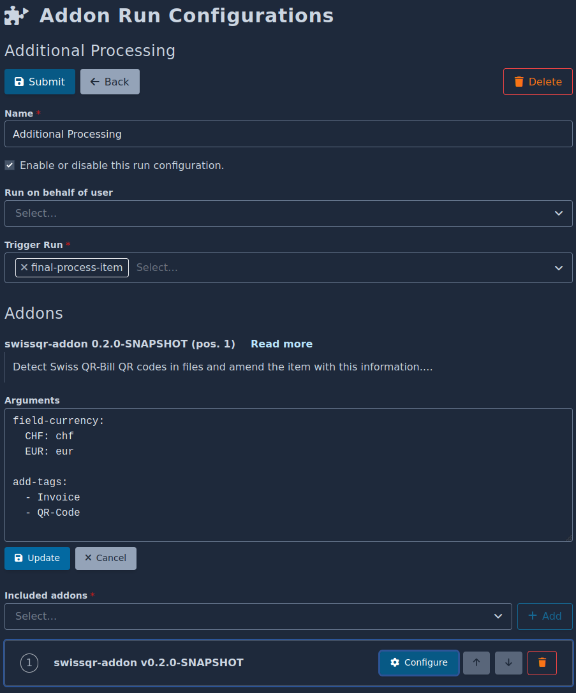

# Swiss QR Addon

This is an addon for [Docspell](https://docspell.org) to process
[Swiss QR
Code](https://www.paymentstandards.ch/dam/downloads/ig-qr-bill-en.pdf)
that appears on most invoices.

This project provides a simple cli tool to read these qr codes from
images and pdf files. It can be installed as an docspell addon to
process each (invoice) file and add the extracted information as
metadata to the document.

# Usage

Use the latest released ZIP file to install this addon. It can be found
[here](https://github.com/docspell/swiss-qr-addon/releases/download/latest).

Create a new [addon run
configuration](https://docspell.org/docs/addons/using/#run-configuration)
and add this addon to it having it run on `final-process-item`. This
way the addon is run with every new file uploaded to Docspell.

## Configuration

The addon does the following:

- detects QR codes on each file and tries to read them as [Swiss
  QR-Bill](https://www.paymentstandards.ch/dam/downloads/ig-qr-bill-en.pdf)
  qr codes (other QR codes are ignored)
- if successful, the amount can be attached to a custom field and tags can be added
- the data from the qr code is added to the item notes

You can optionally configure some steps using a YAML configuration.
Here is an example:

```yaml
field-currency:
  CHF: chf
  EUR: eur

add-tags:
  - Invoice
  - QR-Code

check-tags
  - Invoice
```

The `field-currency` is a map that defines the name of a custom field
given a currency code. This custom field is used to set the amount of
the invoice. When multiple QR codes appear, the amount is summed up.

The `add-tags` section is a list of tags (they must exist) that are
added to the item when at least one QR code was found and decoded.

With `check-tags` you can tell the addon to only run when at least on
of the defined tags are already present on an item. This can be useful
if the tag classification works well and so you only apply this addon
to documents classified as "Invoice", for example.

Each section is optional. You need to define `field-currency` and
`add-tags` if you want to add additional tags or set the amount to a
custom field.

## Example

### Config



### Outcome


## Runner

The addon works with the `trivial` and `docker` runners. A docker
image is build and published on each release, so there is no
`Dockerfile` provided.

When using `trivial`, you need to have JDK 11+ installed (which is a
prerequisite for Docspell itself, so it should be available already).
